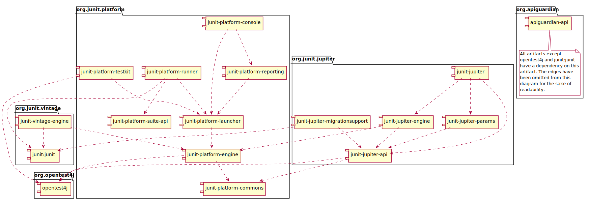

# tutorial-junit5
## 简介
JUnit是一个Java测试框架，JUnit5是下一代的JUnit。<br>
JUnit 5 = JUnit Platform + JUnit Jupiter + JUnit Vintage  

- JUnit Platform 测试框架的基础  
- JUnit Jupiter 基于Java8+的新特性做的更改  
- JUnit Vintage 为了向下兼容JUnit4、JUnit3   
 
更多内容参考[官网](https://junit.org/junit5/) 、[官方文档](https://junit.org/junit5/docs/current/user-guide/) 、[常用注解说明](https://junit.org/junit5/docs/current/user-guide/#writing-tests-annotations)

## 快速开始

### 版本要求
  - JDK 1.8+
  - Spring Boot 2.2.x
### 使用步骤
1. 引入依赖包

   ```xml
   <dependency>
   	<groupId>org.springframework.boot</groupId>
   	<artifactId>spring-boot-starter-test</artifactId>
   	<scope>test</scope>
   	<exclusions>
   		<exclusion>
   			<groupId>org.junit.vintage</groupId>
   			<artifactId>junit-vintage-engine</artifactId>
   		</exclusion>
   	</exclusions>
   </dependency>
   ```

   或者

   ```xml
   <dependency>
       <groupId>org.junit.platform</groupId>
       <artifactId>junit-platform-launcher</artifactId>
       <version>1.6.2</version>
       <scope>test</scope>
   </dependency>
   <dependency>
       <groupId>org.junit.jupiter</groupId>
       <artifactId>junit-jupiter-engine</artifactId>
       <version>5.6.2</version>
       <scope>test</scope>
   </dependency>
   <dependency>
       <groupId>org.junit.vintage</groupId>
       <artifactId>junit-vintage-engine</artifactId>
       <version>5.6.2</version>
       <scope>test</scope>
   </dependency>
   ```

2. 创建测试类  

2.1 简单示例  
```java
@SpringBootTest
class Junit5ApplicationTests {

    @Test
    void contextLoads() {
    }

}
```

2.2 详细示例  
```java
//该注解用于构建Spring Boot上下文环境
@SpringBootTest
class MyFirstJUnitJupiterTests {

    //@Autowired

    //用于添加when条件
    //@MockBean

    //介于@Autowired与@MockBean之间，有条件执行条件，无条件则正常执行方法
    @SpyBean
    private Svc svc;

    /**
     * 所有方法之前执行一次
     */
    @BeforeAll
    static void beforeAll() {
        System.out.println("@BeforeAll-----------");
    }

    /**
     * 所有方法之后执行一次
     */
    @AfterAll
    static void afterAll() {
        System.out.println("@AfterAll-------------");
    }

    /**
     * 每个@Test方法之前执行一次
     */
    @BeforeEach
    void beforeEach() {
        System.out.println("@BeforeEach-------------");
    }

    /**
     * 每个@Test方法之后执行一次
     */
    @AfterEach
    void afterEach() {
        System.out.println("@AfterEach-------------");
    }

    /**
     * 测试方法
     */
    @Test
    @Tag("dev")
    @DisplayName("dev#addTest")
    //@Disabled
    void addTest() {
        when(svc.add(1, 1)).thenReturn(2);
        System.out.println("addTest()");
        int res = svc.add(1, 1);
        Assertions.assertEquals(2, res);
    }

    /**
     * 测试方法
     */
    @Test
    @Tag("prod")
    @DisplayName("prod#minusTest")
    void minusTest() {
        System.out.println("minusTest()");
        int res = svc.minus(2, 1);
        Assertions.assertEquals(1, res);
    }
}
```

## 依赖关系
